<table>
<tr>
<td valign="top"></td>
<td valign="top"></td>
</tr>
</table>

# Fikri Tri Wibowo

**Information Technology Student · Cybersecurity · AI/ML · Software Development**

[GitHub](https://github.com/deserveto) ·
[LinkedIn](https://www.linkedin.com/in/fikri-tri-wibowo-446034296/) ·
[Instagram](https://www.instagram.com/fikritw_/)

## About Me

I am an Information Technology student at Telkom University with a strong interest in cybersecurity, artificial intelligence, networking, cloud infrastructure, and software development. I enjoy building practical systems, exploring security problems, and applying machine learning to real-world challenges.

## Featured Projects

| Project | Description | Access |
| --- | --- | --- |
| **PhishGNN-EEF** | Research on phishing website detection using Graph Neural Networks with enhanced edge features on hyperlink graphs. | Research project |
| **[VulnScan Toolkit](https://github.com/deserveto/vulnscan-toolkit)** | A command-line vulnerability scanner that combines Nmap service discovery, NSE checks, CVE correlation, and minimalist HTML reporting. | Public repository |
| **[ZipLift](https://github.com/deserveto/ZipLift)** | A cross-platform archive manager built with Tauri, Rust, React, and TypeScript for creating, browsing, and extracting common archive formats. | Public repository |
| **Azure VM Portfolio** | A portfolio deployment on an Ubuntu virtual machine using Apache, PHP, Git, and firewall configuration. | Infrastructure project |

## Technology Stack

- **Languages:** Python, JavaScript, TypeScript, PHP, Java, C++
- **AI / ML:** PyTorch, PyTorch Geometric, Graph Neural Networks, scikit-learn
- **Web:** Laravel, Next.js, HTML, CSS, Tailwind CSS
- **Cloud and infrastructure:** Azure, Google Cloud, Linux, Apache
- **Security and networking:** Vulnerability assessment, phishing detection, Wireshark, Packet Tracer
- **Tools:** Git, GitHub, Docker, VS Code

## Contact

- GitHub: [@deserveto](https://github.com/deserveto)
- LinkedIn: [Fikri Tri Wibowo](https://www.linkedin.com/in/fikri-tri-wibowo-446034296/)
- Instagram: [@fikritw_](https://www.instagram.com/fikritw_/)
